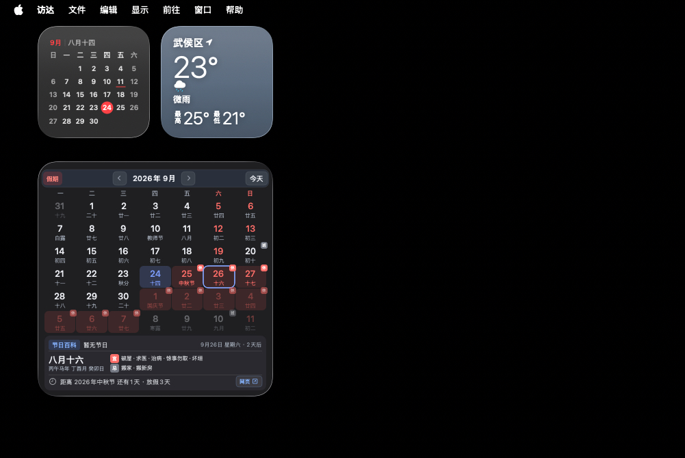
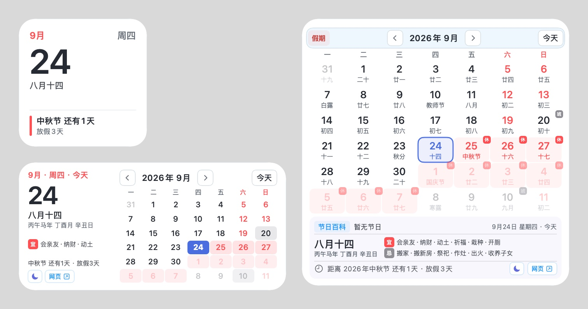
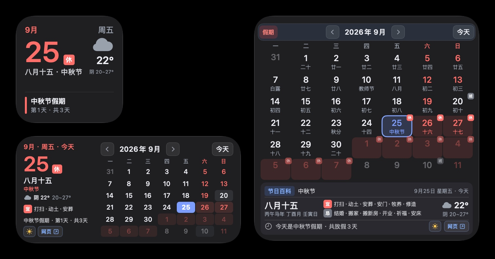

# 桌面日历 · macOS Desktop Calendar

一个原生 macOS WidgetKit 桌面小组件，把百度搜索里的“日历”卡片搬到桌面上：公历月视图、农历、二十四节气，以及与官方同步更新的法定节假日和调休安排。

<p align="center">
  
</p>

提供小、中、大三种尺寸。小组件默认跟随系统外观，也可以点太阳/月亮按钮手动切换浅色或深色。

**浅色模式**

<p align="center">
  
</p>

**深色模式**

<p align="center">
  
</p>

## 功能

- 公历月视图、农历日期、二十四节气与常见节日
- 法定节假日及调休（休/班）标记，与百度日历同步；国务院公布新的放假安排后自动显示
- 距离下一个法定假期的倒计时和放假天数
- 补班提醒：补班前一天显示“明天补班”，补班当天显示“今天补班”
- 点击当月任意日期即可选中，在底部查看当日节日、农历、干支和宜忌
- 左右箭头切换月份，“今天”按钮回到当前月份
- 底部“网页”按钮可打开百度日历
- 作为系统桌面小组件运行，支持 Mission Control、空间切换和系统桌面布局
- 提供三种尺寸：小号为今日卡片（农历与下一个假期倒计时）；中号左侧显示选中日期的详情、右侧为可点击的月历；大号为完整月历加底部详情
- 点击组件空白处打开百度日历网页
- 支持浅色与深色两套配色，默认跟随系统外观自动切换（包括“自动”外观随时间切换）
- 右下角的太阳/月亮按钮可手动切换浅色或深色；切回与系统一致的外观时自动恢复跟随系统
- 适配系统的单色显示（桌面被窗口遮挡时），节假日、补班标记依然清晰可辨

## 下载安装

要求 macOS 14.0 及以上，同时支持 Apple 芯片和 Intel 芯片。

1. 在 [Releases](https://github.com/ljzxzxl/macOS-desktop-calendar/releases/latest) 页面下载最新的 `DesktopCalendar-x.y.z.dmg`。
2. 打开 DMG，把 `DesktopCalendar.app` 拖到「应用程序」文件夹。**请务必先拖进去再打开**，直接在 DMG 或“下载”文件夹里运行会导致小组件显示为灰色占位。
3. 本应用使用开发证书签名，未经过 Apple 公证，首次打开会被系统拦截。任选一种方式放行：
   - 在终端执行下面的命令后，再双击打开：
     ```bash
     xattr -dr com.apple.quarantine /Applications/DesktopCalendar.app
     ```
   - 或者先双击打开一次，出现拦截提示后，到“系统设置 → 隐私与安全性”，在页面底部点“仍要打开”。
4. 打开后会显示引导窗口，告诉你小组件是否已经添加到桌面，并列出添加方法。之后随时点应用图标都可以再次查看。窗口打开时会自动检查更新，也可以点“检查更新”或在菜单中选择“检查更新…”手动检查，有新版本时可直接前往下载。关闭窗口后应用自动退出，小组件不受影响。
5. 在桌面空白处右键，选择“编辑小组件…”，搜索“桌面日历”，把中号或大号组件拖到桌面。

更新时下载新版 DMG，覆盖「应用程序」里的旧版，重复第 3 步后打开一次即可。如果桌面上的组件没有变化，执行一次 `killall chronod`。

## 从源码构建

需要 Xcode 16 及以上，以及一个 Apple Developer 账号（免费账号即可，用于开发签名）。

1. 用 Xcode 打开 `DesktopCalendar.xcodeproj`。
2. 在 `DesktopCalendar` 和 `DesktopCalendarWidget` 两个 target 的 **Signing & Capabilities** 中选择你自己的 Team。如有冲突，把 Bundle Identifier 改成你自己的前缀。
3. 选择 `DesktopCalendar` scheme，Product → Archive 或直接 Build。
4. 把生成的 `DesktopCalendar.app` 拷贝到 `/Applications` 或 `~/Applications`，运行一次以注册小组件。

也可以用命令行构建：

```bash
xcodebuild -project DesktopCalendar.xcodeproj \
  -scheme DesktopCalendar \
  -configuration Release \
  -derivedDataPath build/DerivedData \
  DEVELOPMENT_TEAM=<你的 Team ID> \
  -allowProvisioningUpdates \
  build
```

> 如果 `xcode-select -p` 指向的是 CommandLineTools，请在命令前加上 `DEVELOPER_DIR=/Applications/Xcode.app/Contents/Developer`。

> WidgetKit 扩展需要正规的开发签名才能被系统识别。`build-widget.sh` 使用 ad-hoc 签名，只适合快速检查能否编译，生成的小组件可能不会出现在小组件列表里。

### 打包发布

```bash
DEVELOPMENT_TEAM=<你的 Team ID> scripts/package-release.sh
```

脚本会构建通用架构（arm64 + x86_64）的 Release 版本，校验签名后生成 `build/release/DesktopCalendar-<版本号>.dmg`，把它上传到 GitHub Releases 即可。

### 更新已安装的版本

替换 `DesktopCalendar.app` 后，负责桌面小组件的系统服务 `chronod` 仍会持有旧扩展，需要重启它并运行一次新版：

```bash
killall chronod
open ~/Applications/DesktopCalendar.app
```

## 使用

1. 在桌面右键，选择“编辑小组件”。
2. 搜索“桌面日历”，选择中号或大号并添加。
3. 拖动到合适的位置。

## 数据说明

- 放假调休、节气、节日、农历干支与宜忌数据来自百度日历（与 [百度搜索“日历”](https://www.baidu.com/s?wd=%E6%97%A5%E5%8E%86) 同源）。小组件每 6 小时在后台刷新一次并缓存在本地，点击操作始终使用本地缓存，不等待网络。
- 离线且没有缓存时，农历由 macOS 系统日历计算，不显示休/班标记。
- 月份切换和选中的日期只在当天有效，跨天后自动回到今天。
- “宜/忌”仅供参考，不作为专业黄历依据。

## 项目结构

| 路径 | 说明 |
| --- | --- |
| `Sources/CalendarData.swift` | 百度日历数据的拉取、解析与本地缓存 |
| `Sources/CalendarWidget.swift` | 小组件时间线、视图和交互（App Intents） |
| `Sources/WidgetHostMain.swift` | 宿主 App：承载小组件扩展，打开时显示引导窗口（检测是否已添加小组件、添加方法、检查更新） |
| `Resources/` | Info.plist 与 entitlements（扩展需要网络权限） |
| `scripts/package-release.sh` | 构建通用架构版本并打包成用于发布的 DMG |
| `scripts/render-app-icon.swift` | 用代码绘制应用图标，生成 `Resources/Assets.xcassets` 中的各尺寸图片 |

## 常见问题

**打开时提示“无法验证开发者”或“已损坏，无法打开”**

这是 macOS 对未公证应用的拦截，并不是文件真的损坏。按“下载安装”第 3 步执行 `xattr` 命令，或在“隐私与安全性”里点“仍要打开”即可。

**小组件只显示灰色占位块**

通常是系统里注册了多份同名扩展（例如 Xcode 构建目录、旧备份），或者更新后没有重启 `chronod`。可以先查看注册情况：

```bash
pluginkit -mAv | grep desktopcalendar
```

如果出现多条记录，用 `pluginkit -r <路径>` 和 `lsregister -u <App 路径>` 移除多余的那份，再执行上面的 `killall chronod`。

**点击后要约半秒才有变化**

桌面小组件的每次点击都要经过系统服务转发给扩展，重新生成时间线并渲染后才会显示，这是 WidgetKit 的机制，无法做到普通 App 那样即时响应。为了缩短渲染时间，上下月的淡灰色日期不可点击，请用左右箭头切换月份。

## 声明

界面风格参考了搜索引擎中的日历卡片，本项目为个人学习作品，与任何搜索引擎服务商无关。

## 许可证

[MIT](LICENSE)
